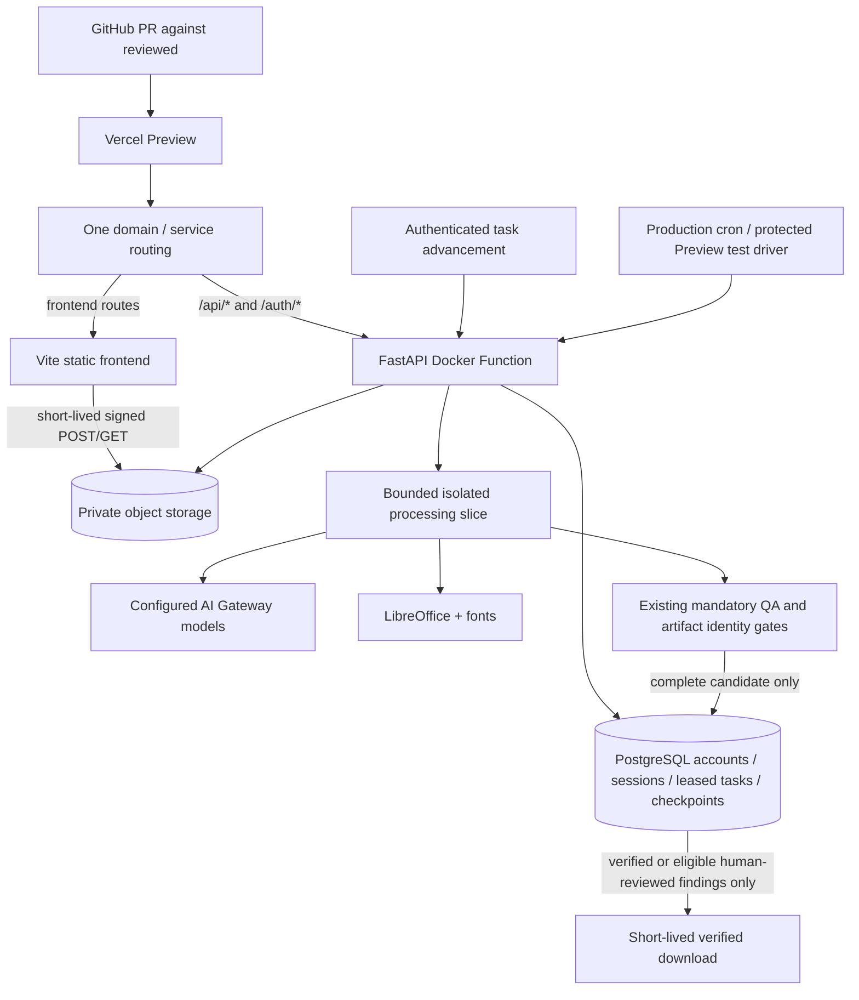

# GitHub → Vercel deployment

**Status: implementation prepared; not approved for production until the Preview checklist below passes.**
This branch starts from GitHub `reviewed` at `b8ce74d`; uncommitted work in the developer's original checkout is not included or changed.

## Why the current site fails

Importing only `frontend/` deploys Vite's static files without FastAPI. A 200 homepage therefore says nothing about `/api/auth/status`. The latter currently receives Vercel's plain-text 404. The UI now detects non-JSON API responses and provides a routing/backend availability message and retry button.

## Platform basis, checked September 29, 2026

- [Services configuration](https://vercel.com/docs/services/config-reference): `services`, with build settings scoped to each service, and service destinations in rewrites. This uses the current beta, not the older `experimentalServices` format.
- [Docker-based Functions](https://vercel.com/kb/guide/docker): `Dockerfile.vercel` packages system dependencies. Containers still scale down and do not provide persistent job state.
- [Function limits](https://vercel.com/docs/functions/limitations): this configuration requires Pro/Enterprise's 800-second invocation and 4 GB memory settings. Files bypass the 4.5 MB function payload limit.
- [Cron behavior](https://vercel.com/docs/cron-jobs/manage-cron-jobs): production cron drives work and cleanup when no browser is open. Cron does not run on Preview deployments. Minute scheduling requires a suitable paid plan; obtain owner approval before a plan upgrade.

Services/Docker availability for the existing project, the Docker function glob, cold starts and actual routing must still be verified on Preview. Documentation and schema validation alone are not deployment evidence.

## Architecture



Workers replay from an immutable input snapshot. Completed model requests and real render results are checkpointed in order, bound to request/image hashes, application/template version and model configuration. PPTX packaging is deterministic so identical edits keep their artifact IDs. Changed evidence fails closed. This retains the existing synchronous slide engine while splitting external operations into finite invocations.

The scheduling implementation is a PostgreSQL leased queue, not the Vercel Workflow SDK. It needs no new Workflow/Queue integration, but retains more local recomputation than a fully step-oriented engine. A crash after a provider finishes but before checkpoint commit can repeat that request. Exactly-once external billing is not promised.

One worker runs per container. Different containers claim different jobs. Leases fence stale workers; cancellation and login revocation prevent publication. Snapshot publication and task completion share one database transaction. No instance exit deletes shared work. A deployment or model configuration change interrupts old jobs with an explicit retry message rather than reusing incompatible QA.

## Dashboard settings (do not change production without approval)

For existing project `stevens-deck-reformatter`:

| Setting | Required value |
| --- | --- |
| Git repository | `LastShaman25/stevens-deck-reformatter` |
| Production branch | Keep `reviewed`; do not merge this PR until Preview acceptance |
| Root Directory | Repository root, not `frontend` |
| Framework Preset | **Services** |
| Build / install / output overrides | Clear project-level overrides; use service settings in root `vercel.json` |
| Compute | Fluid Compute; Pro/Enterprise, 4 GB / 800 seconds for backend |
| Region | Place backend near the database and private bucket |
| Preview branch | `codex/vercel-full-stack` |
| Deployment Protection | Keep enabled; use a test automation bypass secret only for the explicit Preview test |
| Domain | Keep existing production domain; Preview must not be promoted automatically |

Changing Root Directory/Framework affects future production builds. Ask the owner before applying these project-level changes. Do not create a second production project or assign the production domain to a test deployment. Pushes to this PR must only create Preview builds.

## Durable storage to provision only with owner approval

1. **Managed PostgreSQL**, for example Neon through the Vercel Marketplace. Use separate Preview and Production databases/roles with TLS. The app creates its schema; the role needs CREATE on its own database plus normal DML. Use the provider's pooled connection URL. Namespace separation alone is not a substitute for separate credentials between untrusted previews and production.
2. **Private AWS S3 bucket** (or a provider verified to support S3 presigned POST, HEAD, COPY, GET and DELETE). This implementation uses boto3; it does not use Vercel Blob. Do not assume Cloudflare R2 supports the POST upload protocol.
3. Bucket access: block public access, bucket-owner-enforced ownership, default encryption, HTTPS-only policy. Give the backend identity only `s3:ListBucket` for its namespace prefix and `s3:GetObject`, `s3:PutObject`, `s3:DeleteObject` on that prefix. No account-wide S3 permissions.
4. Bucket CORS: exact approved Preview origin(s) and production origin, methods `GET`, `HEAD`, `POST`; allowed headers `*`; expose `Content-Length`, `Content-Type`, `Content-Disposition`, `ETag`; max age 300. Do not send application cookies or CSRF headers to S3.
5. Use a dedicated temporary-processing bucket with versioning **disabled**. Otherwise DeleteObject leaves old versions containing private presentations; configure version lifecycle/deletion before enabling versioning. Set a one-day expiration lifecycle as a fallback for orphaned uploads and snapshots. Normal cleanup runs much sooner. Cloud backup retention must be agreed separately; account backups and document-content retention are different concerns.

Both model checkpoints and session metadata may contain document text. Treat PostgreSQL, S3 and their backups as private presentation data stores. Restrict Preview access and use synthetic inputs until retention/permissions are approved.

### Server environment variables

Set in Vercel **Preview** first. Scope Production separately after acceptance. Never use a `VITE_` prefix for secrets. No `.env` is copied into the container.

| Name | Value / purpose |
| --- | --- |
| `PORT` | `8000` (Vercel container port selection) |
| `STEVENS_STORAGE_MODE` | `shared` |
| `DATABASE_URL` | TLS PostgreSQL pooled URL, Preview-specific |
| `STEVENS_STORAGE_NAMESPACE` | e.g. `studio_preview`; lowercase identifier, 3–41 characters |
| `STEVENS_S3_BUCKET` | Dedicated private temporary bucket |
| `STEVENS_S3_REGION` | Actual bucket region, e.g. `us-east-1` |
| `STEVENS_S3_ACCESS_KEY_ID` | Least-privilege server credential |
| `STEVENS_S3_SECRET_ACCESS_KEY` | Matching secret; never in Git |
| `STEVENS_S3_ENDPOINT_URL` | Omit for AWS S3; verified S3-compatible HTTPS endpoint otherwise |
| `CRON_SECRET` | Cryptographically random secret, at least 32 bytes; Vercel sends Bearer auth to cron |
| `STEVENS_PUBLIC_URL` | Production: `https://stevens-deck-reformatter.vercel.app`; Preview: exact Preview URL, or omit to use trusted `VERCEL_URL` |
| `STEVENS_AUTH_MODE` | `invitation` or `oidc` |
| `STEVENS_ADMIN_CODE` | Invitation bootstrap only: random value ≥20 characters; no default `admin` in cloud mode |
| `STEVENS_OIDC_ISSUER` | OIDC only: HTTPS issuer |
| `STEVENS_OIDC_CLIENT_ID` | OIDC application ID |
| `STEVENS_OIDC_CLIENT_SECRET` | OIDC server secret |
| `STEVENS_INITIAL_ADMIN_EMAIL` | OIDC bootstrap administrator |
| `STEVENS_AI_PROVIDER` | `vercel`; no personal OpenAI key required |
| `AI_GATEWAY_API_KEY` | Institution's Vercel AI Gateway key |
| `STEVENS_AI_PLANNER_MODEL` | Explicit Gateway `creator/model` ID approved for this deployment |
| `STEVENS_AI_REVIEWER_MODEL` | Explicit Gateway `creator/model` ID approved for QA |
| `AI_GATEWAY_REASONING_EFFORT` | Explicit supported planning effort |
| `AI_GATEWAY_REVIEW_REASONING_EFFORT` | Explicit supported review effort |
| `STEVENS_AI_MAX_CALLS` | `0`: no cumulative application spending cap |
| `STEVENS_AI_MAX_TOKENS` | `0`: no cumulative application token cap |
| `STEVENS_LEARN` | `0`: do not persist per-instance learning artifacts |
| `STEVENS_OFFLINE` | `0` for live Preview/Production; CI uses `1` |

The GitHub `reviewed` version groups outline/author/extractor with the planner. Recent uncommitted local work may add a separate generator model group; merge and revalidate that separately rather than silently assuming it is in this PR. Configure available Gateway model IDs explicitly before the live run.

For OIDC, register `<exact-origin>/auth/callback` at the identity provider. Each Preview hostname needs an approved callback or a fixed protected Preview alias. Cookies remain Secure on HTTPS and CSRF/ownership checks remain mandatory. Shared signing material is generated in PostgreSQL; replicas do not invent different cookie keys.

## Existing local accounts

Local mode remains available. No existing SQLite database is uploaded automatically. Before starting an empty cloud account database, an operator may run:

```text
python tools/migrate_accounts.py /path/to/accounts.sqlite3
```

Set `DATABASE_URL` and `STEVENS_STORAGE_NAMESPACE` securely in that shell first. The command opens SQLite read-only and refuses to overwrite a nonempty target or import the known default `admin` code. Rotate that code locally before migration. It copies users, invitation-code hashes and invitations; it intentionally invalidates existing logins and does not transfer local presentations or active jobs. Decide whether Preview should instead use fresh synthetic accounts. Never put the SQLite file in the repository.

## Execution, transfers and cleanup

- Browser upload goes directly to S3 with an exact-size signed POST (five-minute validity), then authenticated completion freezes a distinct immutable input. Existing supported sizes remain 60 MB redesign / 50 MB authoring PDF; 100-page/source-slide and expansion limits remain resource/input limits, not financial budgets.
- API mutations queue durable work and return 202. The browser advances bounded slices; production cron also advances queued or expired-lease work. Duplicate in-flight requests return the existing task; conflicting mutations are rejected.
- Slices aim to yield before the next external operation, with a 600-second process timeout and 720-second lease. Worker model calls use a finite request timeout. Provider errors never count as QA approval.
- On browser interruption, production cron continues; reopening a known session and repeating the same action resumes its pending task. Preview has **no Vercel cron**: keep the browser/test driver advancing, or explicitly invoke the protected tick endpoint. Do not leave Preview jobs unattended; invoke cleanup after tests.
- Normal retention is one idle hour / four absolute hours, cancellation, sign-out or ten minutes after a download. Active leases defer physical deletion but access is revoked immediately. Cron retries failed deletion. If the scheduler is unavailable, application access still expires and the S3 lifecycle is only a delayed backstop; monitor cleanup and restore the scheduler.
- Verified exports are uploaded privately only after the existing candidate-hash and QA gates pass. Signed URLs last 60 seconds and should be treated as bearer credentials. A URL already issued can remain usable until expiration or object deletion; it must never be logged. Finalize after download to clean up.
- LibreOffice and redistributable Liberation/Carlito/Caladea/Noto/TeX Gyre fonts are in the container. Arial/Calibri/Cambria have explicit compatible aliases. Proprietary fonts are not redistributed; QA must flag material substitutions. Inspect equations, CJK text, images and section/cover/closing layouts on the actual Preview render.

## Validation and release checklist

Local/CI contracts are necessary but **not** evidence that live model QA or Vercel execution works. `Shared deployment verification` builds the exact Docker image and runs real PostgreSQL + emulated private S3 tests, including a real LibreOffice render and an interrupted/resumed redesign. Model responses in those tests are explicitly synthetic.

Run `tools/verify_preview.py` against the protected Preview using `PREVIEW_URL`, `PREVIEW_TEST_CODE`, and optional `VERCEL_AUTOMATION_BYPASS_SECRET`. It uses only a synthetic PDF, exercises redraw and topic generation with actual configured models, requires complete QA without human waivers, checks both PPTX/PDF bytes, and finalizes its workspaces. It exits nonzero on any incomplete or failed stage. This incurs AI usage and requires the approved storage setup. Do not redirect it to production.

Record all of the following before approving production:

1. Preview URL + Git commit + Vercel build ID; services/routing and backend health JSON.
2. Successful invitation sign-in and, if configured, an actual OIDC round trip; CSRF failure and a second user's denied access to another workspace.
3. PPTX and PDF direct uploads, including a >4.5 MB valid deck, from a browser (CORS is not tested by a Python client).
4. Topic generation and PDF redesign; approved mostly-red opening, required Thank you closing, all output slides visible.
5. Real LibreOffice renderer/version receipt, equations/fonts/charts inspected; no fallback renderer or skipped tests.
6. All required QA stages complete for every output slide; incomplete QA, tampered candidate and stale generation download requests rejected.
7. Verified PPTX and PDF downloaded and opened; slide/page counts and important content checked. Download must never be enabled merely because a build or sign-in succeeded.
8. Close/reopen during work, retry the same action, concurrent tabs, container termination/lease recovery, cancellation, sign-out and account revocation. Confirm no duplicate publication or leaked workspace.
9. Finalize/cancel and protected tick; verify both database processing rows and private object prefixes are removed. Do not erase account metadata during cleanup.

Only after this evidence exists: ask the owner to approve the production settings/storage change and merge to `reviewed`. Roll back the Git deployment if needed, but do not point old single-instance code at shared state or silently reuse incomplete candidates. The current PR does not perform a production cutover.
